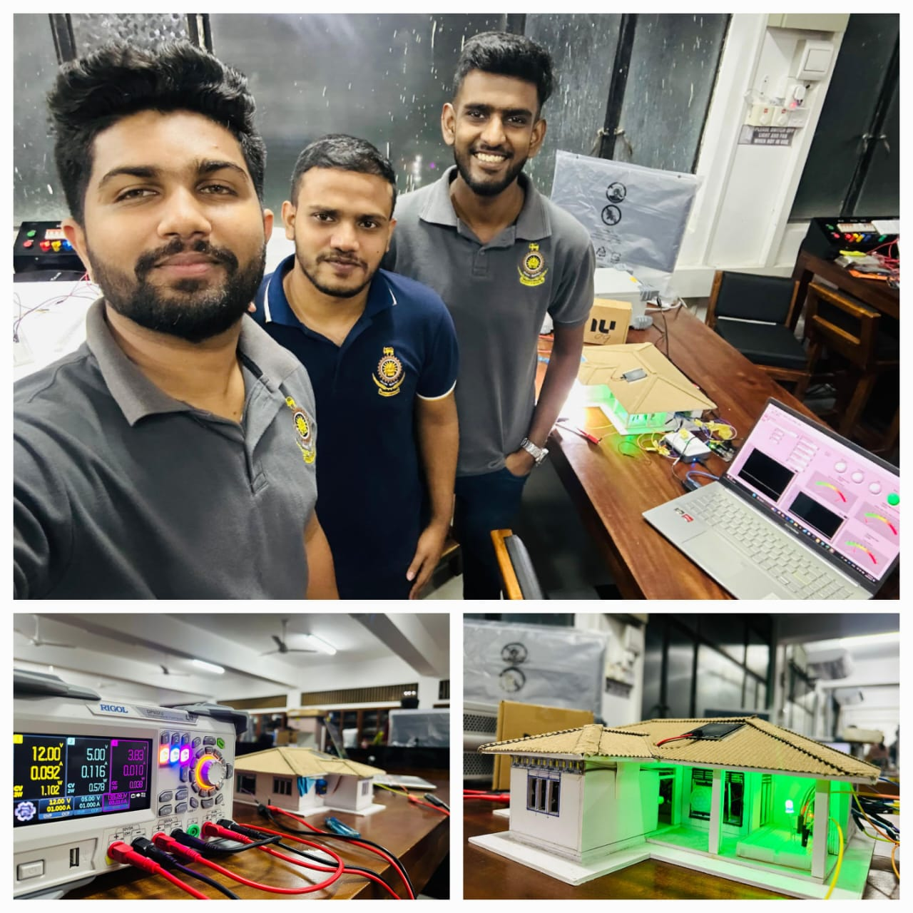

# Smart Home Prototype for Enhanced Safety and Automation

This repository contains the project files for the **Smart Home Prototype**, developed as part of the "Electrical Measurements and Instrumentation" module in Semester 04 at the University of Moratuwa. The system was designed for enhanced safety and automation using **LabVIEW** and **NI DAQmx**, integrating a variety of sensors and actuators to monitor and control the home environment.

## Features

- **Fire Detection System:**
  - Utilizes a calibrated NTC thermistor connected through a Wheatstone bridge for precise temperature monitoring.
  - A buzzer alert is triggered when high temperatures are detected, indicating potential fire hazards.

- **Motion Detection:**
  - A PIR sensor is used to detect motion, activating an LED strip as a visual indicator of movement.

- **Gas Detection:**
  - An MQ2 sensor continuously monitors for combustible gases, triggering a buzzer alarm in the presence of hazardous gases.

- **Automated Roof System:**
  - Controlled by a raindrops module and an SG90 micro servo motor, the roof automatically reacts to rainfall, providing protection for the home.

- **Real-time Data Visualization and Control:**
  - The system is integrated with LabVIEW, providing an intuitive interface for monitoring sensor data in real-time and controlling the system.

## Technologies Used

- **LabVIEW:** Graphical programming for real-time control and monitoring.
- **NI DAQmx:** Data acquisition and control.
- **NTC Thermistor:** Temperature sensing for fire detection.
- **PIR Sensor:** Motion detection.
- **MQ2 Sensor:** Gas detection.
- **Raindrops Module:** Weather condition sensing.
- **SG90 Micro Servo Motor:** Actuation of the automated roof system.

## System Workflow

1. The system monitors temperature, motion, gas presence, and rainfall through connected sensors.
2. When the temperature crosses a threshold, the NTC thermistor triggers a buzzer alarm.
3. The PIR sensor detects motion and illuminates an LED strip.
4. If combustible gases are detected by the MQ2 sensor, an alert is triggered.
5. The raindrops module controls the servo motor to close the roof when it detects rainfall.

## LabView Front Panel

   

## Our Team

   
